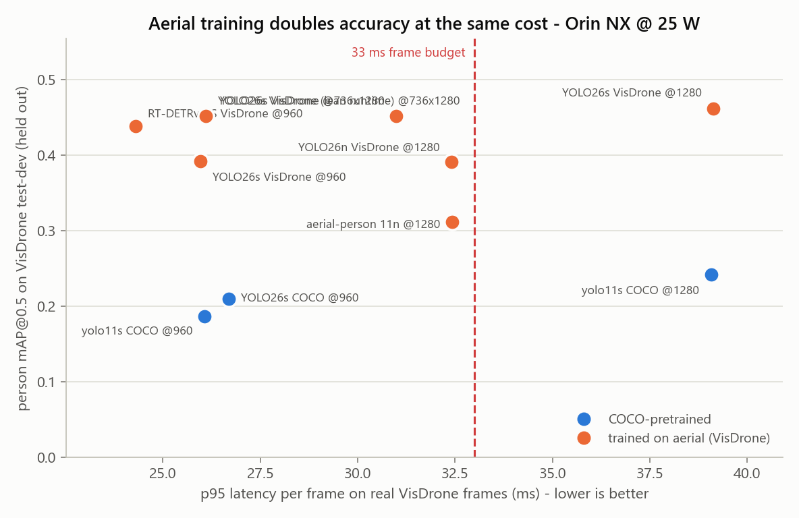
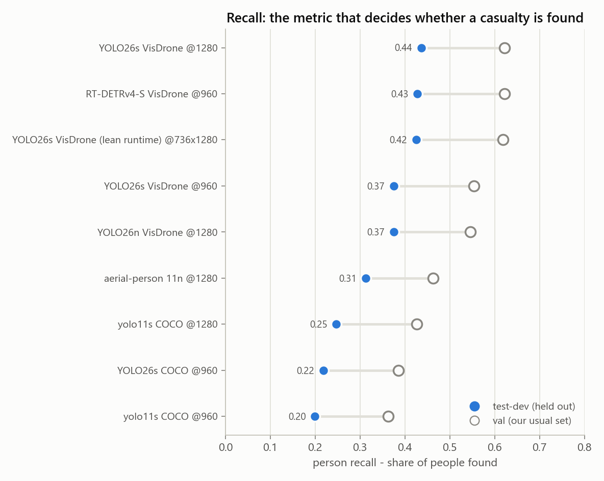

# 10 — Detector Benchmark Results

Two rounds, both measured on the flight computer. **The second round
(2026-09-28) replaces the first round's recommendation.** The first round is kept
below as it was written, because its method and most of its findings still hold.

- [Second round: aerial-trained detectors (2026-09-28)](#second-round-aerial-trained-detectors-2026-09-28)
- [First round: COCO-pretrained detectors (2026-09-20)](#first-round-coco-pretrained-detectors-2026-09-20)

## Second round: aerial-trained detectors (2026-09-28)

Raw rows: [`results/detector.jsonl`](../benchmarks/results/detector.jsonl) (rows
dated 2026-09-28). Joined table: [`figures/reeval_detectors.csv`](../benchmarks/figures/reeval_detectors.csv).
Figures: [`fig5`](../benchmarks/figures/fig5_reeval_detectors.png),
[`fig6`](../benchmarks/figures/fig6_reeval_recall.png), drawn by
[`plot_reeval.py`](../src/analysis/plot_reeval.py).

### Why a second round

Every detector in the first round was trained on COCO, and its headline finding
was that such detectors miss most people seen from the air. Fine-tuning on aerial
data was the planned fix, months away. The question for this round was whether
anything better exists **now, without training anything ourselves**. A survey of
what has been released since the first round turned up three things worth
measuring:

- **Detectors already trained on VisDrone.** Our own accuracy proxy is aerial
  footage, and `dronefreak` published YOLO26 and RT-DETRv4 checkpoints trained on
  it at high resolution (Hugging Face, 2026-09-21/24).
- **A newer architecture,** YOLO26 (Ultralytics 8.4, which is already on the board).
- **Input resolution,** already the biggest lever in the first round.

### What changed in the method

| | |
|---|---|
| Board, software, power mode | Unchanged from the first round (25 W, TensorRT 10.16, FP16) |
| Latency | TensorRT FP16 engines, timed on the **same 200 real VisDrone val frames** as the first round. The first-round baseline re-measures at 26.1 ms against 25.9 ms, so rows from the two rounds compare. |
| Accuracy, val | VisDrone val, 548 images, 13,969 people, the same set as before |
| Accuracy, **test-dev** | **New: VisDrone test-dev, 1,610 images, 27,382 people, 343 images with nobody.** Neither we nor the checkpoint authors used it for anything, so this is the fair column. |
| VisDrone-trained models | They have two person classes, 'pedestrian' and 'people'. Both are merged into one person class and scored with [`person_scoring.py`](../src/common/person_scoring.py) (see *A scoring bug* below). |
| RT-DETRv4 | Ultralytics cannot load it, so it has its own harness, [`bench_rtdetrv4.py`](../src/benchmarks/bench_rtdetrv4.py): ONNX, then TensorRT FP16 via trtexec, timed on the same frames and scored the same way. |

**Val flatters the VisDrone-trained models.** Their authors used VisDrone val to
choose which checkpoint to publish, so val is not held out for them. Test-dev is.
Every comparison below that matters is made on test-dev.

### Results

All rows are TensorRT FP16, with latency measured on real frames. "Max FPS" is
1000 ÷ mean latency, which is what the detector alone could sustain.

| Model | Trained on | Input | p95 ms | Max FPS | Power W | val mAP@0.5 | val recall | **test-dev mAP@0.5** | **test-dev recall** | test-dev precision |
|---|---|---|---|---|---|---|---|---|---|---|
| yolo11s *(first-round pick)* | COCO | 960 | 26.1 | 42 | 13.0 | 0.369 | 0.363 | 0.186 | 0.200 | 0.448 |
| YOLO26s | COCO | 960 | 26.7 | 40 | 12.8 | 0.406 | 0.386 | 0.210 | 0.219 | 0.456 |
| yolo11s | COCO | 1280 | **39.1** ✗ | 28 | 16.2 | 0.447 | 0.426 | 0.242 | 0.247 | 0.496 |
| **RT-DETRv4-S** | VisDrone | 960 | **24.3** | 43 | 15.9 | 0.665 | 0.622 | **0.439** | **0.428** | 0.633 |
| YOLO26s | VisDrone | 960 | 26.0 | 42 | 12.7 | 0.609 | 0.554 | 0.392 | 0.375 | 0.611 |
| **YOLO26s** — lean runtime *(deployed)* | VisDrone | **736×1280** | **26.1** | 42 | 14.4 | 0.692 | 0.619 | **0.452** | **0.425** | 0.639 |
| YOLO26s — through Ultralytics | VisDrone | 736×1280 | 31.0 | 35 | 12.5 | 0.692* | 0.619* | 0.452* | 0.425* | 0.639* |
| YOLO26s | VisDrone | 1280 | **39.1** ✗ | 28 | 16.2 | 0.688 | 0.622 | 0.462 | 0.436 | 0.651 |
| YOLO26n | VisDrone | 1280 | 32.4 | 34 | 11.9 | 0.601 | 0.546 | 0.391 | 0.375 | 0.575 |
| aerial-person yolo11n (`Siddh10`) | VisDrone tiles | 1280 | 32.4 | 34 | 11.7 | 0.511 | 0.463 | 0.312 | 0.312 | 0.505 |

✗ = over the 33 ms hard limit. \* = the same engine as the row above it, so the
same detections; `val()` cannot score a rectangular engine, so its accuracy was
measured through the lean runner ([`bench_lean_yolo.py`](../src/benchmarks/bench_lean_yolo.py),
2026-09-29). It is a little below the square 1280 engine's (test-dev recall 0.425
against 0.436) because VisDrone mixes 16:9 and 4:3 images, and a 4:3 image is
shrunk more to fit 736 px of height. Camera frames are 16:9, where the two see the
same pixels.

**Pose, latency only** (VisDrone has no keypoint labels):

| Model | Input | p95 ms |
|---|---|---|
| yolo11s-pose *(what the live demo runs)* | 960 | 26.5 (26.46 in the first round) |
| **YOLO26s-pose** | 960 | **22.7** |





### Five findings

#### 1. Training on aerial imagery is the lever, and it more than doubles recall

On held-out test-dev, the best COCO detector inside the budget finds **22 %** of
people (YOLO26s). The VisDrone-trained models inside the budget find **37–44 %**,
at the same or lower cost. Neither architecture nor resolution comes close: the
newer YOLO26 adds 2 points of recall over yolo11s, and 1280 px adds 5 while
missing the budget. The first round's conclusion, that recall is the problem and
data is the fix, holds. The difference is that the data fix turned out to be
downloadable rather than months of our own labelling. It is still not *our*
imagery; see [What this still does not tell us](#what-this-still-does-not-tell-us).

#### 2. Higher resolution only pays with a rectangular engine

A 1080p frame letterboxed into a 1280×1280 square is 44 % grey padding. Both
square 1280 engines cost 39 ms on real frames and miss the budget. The same
YOLO26s built for **736×1280**, the frame's own shape, costs **31.0 ms** and
keeps every accuracy gain. `bench_detector.py --imgsz 736,1280` builds it.

#### 3. Synthetic-frame timing hides a third of the cost

This round was first timed on random-noise frames. The square 1280 engines
measured 28 ms that way, which is inside the budget, but 39 ms on real frames.
The difference is resizing larger images and filtering more detections. **Real
frames only from now on.** `plot_results.py` already refused to plot
synthetic-frame rows, which is how the discrepancy came to light.

#### 4. At 1280 px the nano is not faster

YOLO26n at 1280 (32.4 ms) is no faster than YOLO26s at 736×1280 (31.0 ms), and
6 points of recall worse. At this input size preprocessing and post-processing,
not the network, set the latency. The nano leaves the shortlist.

#### 5. Val overstates everything, and most for models tuned on it

Every model loses 15–25 points of mAP from val to test-dev, because test-dev's
people are smaller and denser. The single-class `Siddh10` model drops the most
(20 points of mAP, 15 of recall), consistent with its card's note that it was
evaluated on VisDrone val. **Test-dev is the column to decide on.**

### A scoring bug found and fixed along the way

The first attempt scored the VisDrone-trained models with Ultralytics' `val()`
and `single_cls=True`. **`val()` ignores the `classes` argument**, so
`single_cls` merged all ten VisDrone classes (cars, vans, buses…) into
"person". YOLO26s showed precision 0.25 and mAP 0.18, and would have been
rejected as worse than the COCO baseline.

[`person_scoring.py`](../src/common/person_scoring.py) now does it explicitly:

1. keep only the person classes
2. merge them, with one class-agnostic NMS at IoU 0.7
3. match and summarise with Ultralytics' own `match_predictions` rule and `ap_per_class`

**It agrees with `val()` to within 0.5 points** on the COCO baseline, where `val()`
is correct: mAP 0.374 against 0.369, recall 0.360 against 0.363. The three
wrongly scored rows stay in `detector.jsonl`, with the accuracy moved to
`accuracy_invalid` and the reason, so they cannot be plotted by accident.

### GPU-only timing

The latencies above come from two harnesses:

- **The YOLO rows** go through Ultralytics' Python pipeline (letterbox, NMS,
  result objects).
- **RT-DETRv4** goes through a lean TensorRT runtime, with its post-processing
  inside the engine.

To compare the networks themselves, each engine was also timed by `trtexec`
alone: GPU compute only, 300 iterations after a 2 s warm-up. The YOLO engines
were rebuilt from the ONNX files Ultralytics exported for them. Raw rows:
[`results/gpu_compute.jsonl`](../benchmarks/results/gpu_compute.jsonl).

| Model | Input | GPU compute mean | GPU compute p95 | End to end p95 (real frames) | Harness overhead |
|---|---|---|---|---|---|
| yolo11s COCO | 960 | 11.3 ms | 11.4 ms | 26.1 ms | 14.7 ms |
| YOLO26s COCO | 960 | 11.7 ms | 11.8 ms | 26.7 ms | 14.9 ms |
| YOLO26s VisDrone | 960 | 11.4 ms | 11.4 ms | 26.0 ms | 14.6 ms |
| YOLO26s VisDrone | 736×1280 | 11.4 ms | 11.5 ms | 31.0 ms | 19.5 ms |
| RT-DETRv4-S VisDrone | 960 | 17.1 ms | 17.1 ms | 24.3 ms | 7.2 ms |

**As networks, the YOLOs are the lighter ones.**

- **YOLO26s at 736×1280** needs 11.5 ms of GPU compute.
- **RT-DETRv4-S** needs 17.1 ms.

RT-DETRv4-S's lower end-to-end time came from its leaner harness, not a faster
network. The Ultralytics pipeline adds 15–20 ms per frame in these rows,
more than the network itself. The production detector node should therefore
run the engine directly. That is where the recommendation below comes from.

**Measured 2026-09-29: the lean runner** ([`src/common/trt_yolo.py`](../src/common/trt_yolo.py))
runs the same YOLO26s engine at **26.1 ms p95** end to end on the same real frames,
5 ms less than Ultralytics, with the same detections. It still resizes each frame
on the CPU, which is most of what remains between that and 11.5 ms of GPU compute.


### Recommendation

**Detector: YOLO26s trained on VisDrone ([`dronefreak/visdrone-yolo26s`](https://huggingface.co/dronefreak/visdrone-yolo26s)), as a 736×1280 TensorRT FP16 engine, served through a lean TensorRT runtime.**

- **Recall:** it finds 42.5 % of people on held-out test-dev (mAP 0.452), against
  20.0 % for the first-round pick. That is a tie with RT-DETRv4-S (42.8 %, mAP 0.439).
- **Compute:** it is the lightest network at this accuracy: **11.5 ms of GPU
  compute per frame** ([GPU-only timing](#gpu-only-timing)), against 17.1 ms for
  RT-DETRv4-S. GPU time matters beyond the frame budget, because the VLM shares
  the same GPU.
- **Serve it directly, not through Ultralytics.** Through Ultralytics' Python
  pipeline it measures 31.0 ms p95, only 2 ms inside the budget. Through the lean
  runner it measures **26.1 ms**, with 7 ms to spare. That is how it is deployed.
  NITROS ([04](./04-ros2-architecture.md)) is the flight version of the same idea.

**Permissive-licence alternative: RT-DETRv4-S trained on VisDrone ([`dronefreak/visdrone-rtdetrv4-s`](https://huggingface.co/dronefreak/visdrone-rtdetrv4-s)), 960 px.**

- **Recall:** 42.8 %, under a point behind.
- **Speed:** 17.1 ms of GPU compute, and **24.3 ms p95 end to end** in the lean
  runtime that exists today.
- **Licence:** Apache-2.0 code and weights.

Choose it if the team rules out Ultralytics' AGPL-3.0, the open question in
[02](./02-detection-and-pose.md). Nothing else in the pipeline changes.

Caveats that come with either:

- **The weights inherit VisDrone's licence, CC BY-NC-SA 3.0** (non-commercial).
  That is fine for this university project. Before any commercial use they must
  be replaced by weights fine-tuned on data we have rights to, which is the
  Phase 2 plan anyway.
- **There is no aerial pose model.** VisDrone has no keypoints. The first round's
  design of one pose model doing detection and keypoints
  ([02](./02-detection-and-pose.md)) therefore becomes two stages:
  - **tier 1:** the aerial detector, every frame
  - **tier 2:** posture from crops of each track, at a lower rate. Use
    YOLO26s-pose, 22.7 ms against 26.5 ms for yolo11s-pose. Keypoints are
    unreliable below about 32 px of person height, so small boxes need a direct
    posture classifier instead.
- **Deployed 2026-09-29.** Both detectors, YOLO26s-pose and the two VLMs are staged
  in `~/raptor-deploy`, each verified on the board
  ([`deploy_manifest.json`](../benchmarks/results/deploy_manifest.json)). The live
  demo runs this two-stage pipeline ([14](./14-camera-demo-and-remote-access.md)).

### What this still does not tell us

- **VisDrone is still the proxy.** It is urban, with no casualties, no one lying
  down and no rubble. These models were trained on it, so they are now
  *in-domain* on our benchmark in a way our real footage will not be. Treat
  43 % as the ceiling for this data, not a prediction for a search over desert
  or rubble.
- **Lying people are untested.** The single most important class for RAPTOR does
  not occur in the data. Aerial datasets that do contain lying and sitting people
  (Okutama-Action, NOMAD, SARD, HERIDAL) are the next evaluation to build; the
  data plan is in [05](./05-custom-models-and-data.md).
- **End-to-end (E8) and contention (E7) are still not measured.** A detector at
  24–31 ms and a VLM on the same GPU have never run together.

## First round: COCO-pretrained detectors (2026-09-20)

> **Superseded.** This round's recommendation is replaced by the
> [second round's](#recommendation) above. Its method, and findings 1–3, still
> stand; the test-dev column above shows the recall problem was even worse than
> VisDrone val suggested.

Measured on the flight computer, 2026-09-20. Raw rows:
[`results/detector.jsonl`](../benchmarks/results/detector.jsonl) and
[`results/raw_forward.jsonl`](../benchmarks/results/raw_forward.jsonl).
Figures: [`figures/`](../benchmarks/figures).

This is experiment **E1** from [06](./06-benchmark-plan.md), plus a TensorRT data
point from Phase B of [02](./02-detection-and-pose.md). E2 (INT8), E3 (altitude),
E4 (tiling), E7 (contention) and E8 (end-to-end) are **not** done — see
[§ What this does not tell us](#what-this-does-not-tell-us).

### Conditions

| | |
|---|---|
| Board | Jetson Orin NX 16 GB (Seeed reComputer J401) |
| Software | JetPack 7.2 / L4T 39.2.0, **Ubuntu 24.04.4**, CUDA 13.0, TensorRT 10.16.2 |
| Stack | torch 2.14.0+cu130, ultralytics 8.4.154 |
| Power mode | **25 W** (`nvpmodel` mode 3), `jetson_clocks` **not** pinned |
| Precision | FP16 throughout |
| Data | VisDrone-DET val, single `person` class — 548 images, 13,969 boxes, ~25 people/image |
| Protocol | 50 warm-up inferences discarded, 200 frames measured, `tegrastats` sampled throughout |

**The board runs Ubuntu 24.04, not 22.04.** [04](./04-ros2-architecture.md) and
[07](./07-roadmap.md) both assume JetPack 6.x and ROS 2 Humble. Humble has no
24.04 binaries; **Jazzy** is the correct pairing for this image. That also means
NVIDIA Isaac ROS (Humble-targeted) becomes a container decision rather than a
native install — relevant to Phase D in [02](./02-detection-and-pose.md).

### Detection results

| Model | Input | Backend | p95 ms | FPS | mAP@0.5 | mAP@0.5:0.95 | Precision | Recall | Power W | Peak GPU MB |
|---|---|---|---|---|---|---|---|---|---|---|
| yolo11n | 640 | PyTorch | 29.1 | 29.9 | 0.159 | 0.057 | 0.434 | 0.180 | 8.4 | 44 |
| yolo11s | 640 | PyTorch | 29.2 | 29.5 | 0.247 | 0.095 | 0.480 | 0.268 | 9.8 | 64 |
| yolo11n | 832 | PyTorch | 29.7 | 29.4 | 0.233 | 0.089 | 0.470 | 0.250 | 9.4 | 49 |
| yolo11s | 832 | PyTorch | 29.9 | 28.8 | 0.326 | 0.136 | 0.540 | 0.327 | 12.1 | 71 |
| yolo11n | 960 | PyTorch | 30.1 | 29.5 | 0.268 | 0.109 | 0.481 | 0.283 | 10.2 | 52 |
| yolo11s | 960 | PyTorch | 30.4 | 29.2 | 0.369 | 0.158 | 0.563 | 0.361 | 13.3 | 77 |
| yolo11m | 640 | PyTorch | **34.7** ✗ | 25.5 | 0.307 | 0.125 | 0.573 | 0.300 | 12.7 | 95 |
| **yolo11s** | **960** | **TensorRT** | **25.9** | **30.1** | **0.369** | **0.159** | 0.558 | **0.363** | 12.6 | 98 |

✗ = exceeds the 33 ms hard limit.

#### Pose models (latency only)

VisDrone has no keypoint labels, so these carry no accuracy figure. They are here
because tier 2 needs keypoints and [02](./02-detection-and-pose.md) specifies
**one pose model rather than a separate detector** — so pose latency, not detect
latency, is what the frame budget must actually accommodate.

| Model | Input | p95 ms | Power W | In budget |
|---|---|---|---|---|
| yolo11n-pose | 640 | 31.7 | 8.6 | yes |
| yolo11n-pose | 832 | 32.2 | 9.6 | yes |
| yolo11s-pose | 640 | 32.3 | 10.0 | yes |
| yolo11s-pose | 960 | 32.8 | 13.5 | yes |
| yolo11n-pose | 960 | 32.9 | 10.2 | yes |
| yolo11s-pose | 832 | **33.0** | 12.2 | **marginal** |
| **yolo11s-pose** | **960** | **26.5 (TensorRT)** | 14.5 | **yes, with 6.5 ms spare** |

**Every pose configuration sits within 1 ms of the hard limit in PyTorch.** Tier 2
has no headroom at all on that stack, and that is before ByteTrack, the posture
classifier, or anything else shares the board.

TensorRT fixes it. The same weights, same input size:

| yolo11s-pose @960 | PyTorch | TensorRT | change |
|---|---|---|---|
| mean latency | 30.2 ms | **20.4 ms** | −32% |
| p95 latency | 32.8 ms | **26.5 ms** | −19% |
| headroom to 33 ms | 0.2 ms | **6.5 ms** | 32× more |
| power | 13.5 W | 14.5 W | +1 W |

Stage breakdown for the TensorRT engine: **preprocess 3.3 ms, inference 12.7 ms,
postprocess 3.5 ms**. Inference is now only 62% of the frame cost — a third of the
budget goes on Python-side image handling and NMS. That is the strongest argument
yet for composable nodes and zero-copy (NITROS) in
[04](./04-ros2-architecture.md): the next big win is not a faster model.

### Three findings

#### 1. Resolution beats capacity

yolo11s @ 960 beats yolo11m @ 640 on **accuracy (0.369 vs 0.307), latency
(30.4 vs 34.7 ms) and power (13.3 vs 12.7 W is a near tie, but yolo11m misses the
budget)**. yolo11m is dominated and should leave the shortlist for this input
regime.

This is what [02](./02-detection-and-pose.md) predicted: when targets are 15–25 px
tall, the limit is pixels on target, not model capacity. Going from 640 to 960
raised yolo11s mAP from 0.247 to 0.369 — a **49% relative gain for ~1 ms**.

#### 2. The measured latency was framework overhead, not compute

Across the PyTorch sweep, p95 moved 29.1 → 30.4 ms while mAP went 0.159 → 0.369
and power went 8.4 → 13.3 W. Power rising while wall-clock stands still means the
GPU is doing much more work in the same elapsed time.

Timing `forward()` alone, with Ultralytics' `predict()` wrapper removed:

| Model | Input | Forward-only mean ms | Power W |
|---|---|---|---|
| yolo11n | 640 | 28.2 | 9.6 |
| yolo11n | 960 | 28.5 | 13.0 |
| yolo11s | 640 | 28.3 | 12.4 |
| yolo11s | 960 | **27.7** | **21.7** |
| yolo11m | 640 | 36.0 | 18.4 |
| yolo11m | 960 | 54.5 | 23.0 |

The small models sit on a **~28 ms floor** irrespective of input size, while
yolo11m scales normally. That is the signature of being **CPU kernel-launch
bound**: PyTorch eager mode dispatches hundreds of small CUDA kernels per forward,
and Orin's CPU cannot issue them faster than that.

TensorRT confirms it — the same weights, same precision, same input:

| | PyTorch | TensorRT | change |
|---|---|---|---|
| mean latency | 28.8 ms | **24.2 ms** | −16% |
| p95 latency | 30.4 ms | **25.9 ms** | −15% |
| mAP@0.5 | 0.3687 | **0.3687** | none |
| recall | 0.361 | 0.363 | none |
| power | 13.3 W | 12.6 W | −5% |

Two things follow. **FP16 TensorRT export costs zero accuracy here** — worth
knowing before anyone spends time worrying about it. And the gain is 15%, not 3×,
which means once inference is fused the remaining cost is Python-side
preprocessing and NMS. That is the argument for composable nodes and zero-copy
(NITROS) in [04](./04-ros2-architecture.md), now with a number attached.

> Note the power column in the forward-only table: yolo11s @ 960 draws **21.7 W**
> when the framework stops throttling it — over the 20 W sustained target from
> [06](./06-benchmark-plan.md). The comfortable power figures in the main table
> are partly an artefact of the GPU idling between kernel launches. Power must be
> re-measured once the pipeline is efficient.

#### 3. Recall is the problem, and it is worse than the latency story

The best configuration measured **recall 0.363**. An off-the-shelf COCO-pretrained
detector finds roughly **one in three** annotated people in aerial imagery. The
weakest configuration (yolo11n @ 640) finds fewer than one in five.

[05](./05-custom-models-and-data.md) names recall at high precision as the headline
metric, because in SAR a missed person is far worse than a false alarm. By that
measure none of these models is fit for deployment yet.

This is not a defect in YOLO; it is the aerial domain gap, quantified. It makes
Phase 2 data collection the **critical path**, not a parallel activity. Two
mitigations cost no compute at all:

- **Fly lower.** Detection scales with pixels on target.
- **Never report a searched area as confirmed clear.** Measured recall does not
  support that claim, and an operator who believes it stops searching too early.

### Alternative architectures

[02](./02-detection-and-pose.md) keeps two non-YOLO11 options on the shortlist:
**YOLOv8** as the battle-tested fallback, and **RT-DETR** as the escape hatch if
Ultralytics' AGPL licence ever becomes a blocker. Both were measured.

| Model | Input | Backend | p95 ms | mAP@0.5 | Recall | Power W | In budget |
|---|---|---|---|---|---|---|---|
| yolov8s | 640 | PyTorch | 23.5 | 0.228 | 0.246 | 10.6 | yes |
| yolov8s | 960 | PyTorch | **25.2** | 0.355 | 0.352 | 14.4 | yes |
| yolo11s | 960 | PyTorch | 30.4 | 0.369 | 0.361 | 13.3 | yes |
| yolo11s | 960 | TensorRT | 25.9 | 0.369 | 0.363 | 12.6 | yes |
| **rtdetr-l** | 960 | PyTorch | **110.7** ✗ | **0.431** | **0.410** | 17.8 | **no** |

#### YOLOv8 is faster than YOLO11 here — and that corroborates finding 2

yolov8s @ 960 ran at **25.2 ms p95 in plain PyTorch** — matching yolo11s *in
TensorRT* (25.9 ms) — for 0.355 mAP against 0.369. YOLO11 is the more accurate
architecture per parameter, but on this board it is also the slower one, because
YOLO11's C3k2/C2PSA blocks decompose into more individual CUDA kernels than
YOLOv8's simpler graph. When the bottleneck is kernel dispatch rather than
arithmetic, graph complexity costs wall-clock directly.

Practical consequence: **YOLOv8s is a credible PyTorch-only fallback** if the
TensorRT export path ever fights us, at a cost of about 4% relative mAP.

(Caveat: the YOLO11 sweep and the YOLOv8 runs were separate invocations. The gap
is large and consistent across both input sizes, but a single interleaved re-run
would remove any doubt about drift.)

#### RT-DETR is the most accurate model tested, and far too slow

rtdetr-l @ 960 produced **mAP@0.5 0.431 and recall 0.410** — comfortably the best
of anything measured, roughly **17% better mAP and 13% better recall** than
yolo11s @ 960. It is also **110.7 ms p95**, more than three times the hard limit.

Unlike the YOLO models, RT-DETR is genuinely compute-bound: its stage breakdown is
**99.7 ms of inference** against 6.8 ms preprocess and 1.7 ms postprocess. There is
no framework overhead to reclaim here; the work is real.

Three things follow:

- **Accuracy headroom exists.** The aerial recall ceiling in finding 3 is a
  property of these small models, not of the task. A larger model finds
  meaningfully more people.
- **RT-DETR is a candidate for a "careful search" mode**, not for continuous
  flight. [02](./02-detection-and-pose.md) already contemplates a slow, high-recall
  mode for tiled inference; ~9 FPS is plausible for a deliberate hover-and-scan
  over a suspected location, and it would find more casualties than the fast path.
- **The licence escape hatch costs speed, not accuracy.** If AGPL ever forces the
  move to RT-DETR (Apache-licensed lineage), the sacrifice is throughput. That
  reframes the licensing decision usefully — and TensorRT plus INT8 has not yet
  been tried on it.

**Known issue:** `rtdetr-l @ 640` failed during validation with
`RuntimeError: Expected all tensors to be on the same device, but found at least
two devices, cuda:0 and cpu` — an Ultralytics RT-DETR validator bug, not a board
problem. The 960 run completed normally. Not chased further; recorded here so the
gap in the results table is explained rather than mysterious.

### What this does not tell us

- **Nothing about prone casualties specifically.** VisDrone is urban — roads,
  squares, car parks. It contains no casualties and essentially no prone figures.
  The failure mode RAPTOR most needs to measure is precisely the one this dataset
  cannot measure. HERIDAL and SARD are the right next datasets.
- **Nothing about pose or posture accuracy** — no keypoint labels, and the posture
  classifier does not exist yet.
- **Nothing about thermals.** Runs were minutes; any thermal claim needs 20 minutes
  minimum. Peak observed was 67 °C during the TensorRT run, with no throttling seen.
- **Nothing about contention (E7).** The detector and VLM have not yet run
  simultaneously, which is the experiment that decides whether DLA offload is
  required.
- **Nothing about INT8 (E2).** Deliberately not attempted: calibration must use our
  own aerial footage, and calibrating on COCO or VisDrone and deploying on our
  imagery is a documented way to lose accuracy silently.

### Two environment defects found

**1. PyTorch has no kernels for this GPU.** `torch 2.14.0+cu130` is the generic
PyPI aarch64 wheel, built for compute capabilities 8.0/9.0/10.0/11.0/12.0. Orin is
**8.7**. It works — CUDA JIT-compiles PTX for sm_87 — but these are not NVIDIA's
sm_87-tuned kernels. **Every number in this document is a floor.** Installing
NVIDIA's Jetson build for JetPack 7 and re-running is the highest-value fix
outstanding.

**2. The board clock reads 1970-01-01.** No RTC battery, and no NTP because the
Jetson has no network route. Every result row in this round carries a 1970
timestamp. [04](./04-ros2-architecture.md) warns that a wrong clock silently
corrupts timestamp correlation and geolocation — fix this before recording any
rosbag. A temporary fix from a networked machine on the same link:

```bash
ssh alfaisal-x-nx@100.100.100.1 "sudo date -u -s '$(date -u +'%Y-%m-%d %H:%M:%S')'"
```

### Recommendation, and what is deployed

*First-round recommendation, kept as the record. What is deployed today is still
this; the second round recommends replacing the detector.*

**`yolo11s-pose @ 960, FP16, TensorRT`** is the tier-1+2 model — it emits person
boxes *and* the 17 keypoints tier 2 needs, at 26.5 ms p95 with 6.5 ms of headroom.
Per [02](./02-detection-and-pose.md), running a separate detector alongside it
would double the cost for nothing.

**`yolo11s @ 960, FP16, TensorRT`** is deployed alongside it as the detection-only
baseline, for A/B work and for a degraded mode where keypoints are not needed.

Both are staged under `~/raptor-deploy/` on the board with a provenance manifest
(`MANIFEST.json`) recording source weights, SHA, build environment, and the
measured numbers above. Each was verified by loading and running it after staging.
Regenerate with `src/deploy/deploy_models.py --verify`.

> **Engines are not portable.** A `.engine` is tied to this TensorRT version and
> GPU. Re-export after any JetPack upgrade; never copy one between boards.

Next, in order:

1. Install NVIDIA's sm_87 PyTorch build and re-run — everything here is a floor.
2. Fix the board clock before any rosbag is recorded.
3. Attack preprocess + NMS, not the model: they are now 38% of the frame budget.
4. Re-measure inside a long-running ROS 2 node rather than per-process runs.
5. Run the power-mode sweep (10/15/25/40 W). The board supports **40 W** and
   MAXN_SUPER; everything here was measured at 25 W, and the delta decides whether
   the extra watts are worth the endurance cost.
6. Start Phase 2 collection flights. Finding 3 is the justification.
