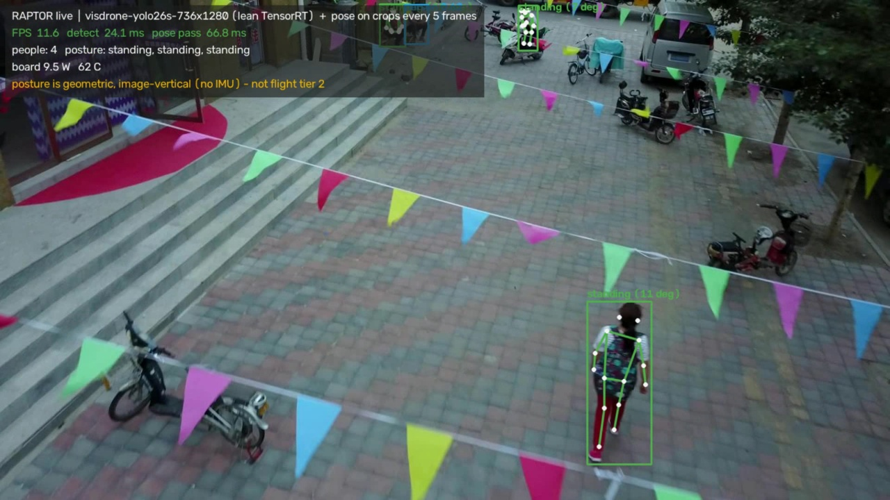

# 14 — Camera, Live Demo and Remote Access

Measured 2026-09-20. Raw row:
[`results/camera.jsonl`](../benchmarks/results/camera.jsonl).
Annotated frame:
[`figures/live_person_detection.jpg`](../benchmarks/figures/live_person_detection.jpg).

This is experiment **E3b** from [06](./06-benchmark-plan.md), plus the first
end-to-end run of the deployed model on live frames.

## What is actually attached

**Not the flight camera.** The device on the bench is a **Logitech C922 Pro
Stream Webcam** on USB, not the SIYI A8 mini through an HDMI capture card. It is
a perfectly good stand-in for developing the pipeline, but it means:

- the **HDMI → capture-card path in [01](./01-system-overview.md) and
  [04](./04-ros2-architecture.md) remains unverified**, including the open
  question of whether the A8 mini can output HDMI and Ethernet video at the same
  time — [06](./06-benchmark-plan.md) calls that "cheap and it decides the whole
  harness";
- the optics are wrong for [06](./06-benchmark-plan.md)'s altitude table, which
  assumes the A8 mini's 81° HFOV across 1920 px;
- glass-to-`/dev/video0` latency measured here says nothing about the capture
  card, which is where the tens-to-hundreds of milliseconds would hide.

## The USB link is 2.0, and it matters

```
Bus 001 ... 480M   <- C922 is here, behind a USB2.0 hub
Bus 002 ... 10000M <- USB 3.0 bus, idle
```

[09](./09-jetson-environment.md) warns that a USB 2.0 link degrades silently
rather than failing. Measured, on this device:

| 1920×1080 | Max frame rate |
|---|---|
| **YUYV** (uncompressed) | **5 fps** |
| **MJPG** (compressed) | **30 fps** |

So the trade named in doc 09 — "YUYV costs USB bandwidth, MJPEG costs a decode" —
is not theoretical here: uncompressed 1080p is simply unavailable at frame rate.
**There is an idle USB 3.0 bus on this board.** Moving the camera to it is the
first thing to try before accepting MJPEG.

## First live run: camera → deployed TensorRT pose engine

`yolo11s-pose.engine` @960 FP16, from `~/raptor-deploy/`, on live 1080p MJPG:

| | |
|---|---|
| Negotiated format | 1920×1080 MJPG @30 (as requested) |
| Frame grab | 14.1 ms mean / 15.0 ms p95 |
| Inference | 23.0 ms mean / 25.0 ms p95 |
| **End-to-end** | **26.9 FPS, 0 dropped of 150** |
| Board power | 12.1 W |

Detection was confirmed visually: a person at **0.78 confidence with all 17 COCO
keypoints**, which is exactly the input tier 2's posture classifier consumes.

### The 27 FPS is an artefact of the test loop, not a ceiling

Grab (14.1 ms) and inference (23.0 ms) run **serially** in this benchmark, so the
frame period is their sum. In the architecture [04](./04-ros2-architecture.md)
specifies — `camera_node` and `detector_node` as separate nodes — they pipeline,
and the rate is set by the slower stage alone:

- inference at 23.0 ms → ~43 FPS of headroom
- capture capped at 30 FPS by the device

So **30 FPS is reachable** on this hardware once capture and inference overlap.
This is a concrete argument for composable nodes with intra-process transport,
and a reason not to read 26.9 FPS as a hardware limit.

### One honest oddity

The 0.78-confidence detection was of a **hand** entering frame, not a whole
person. A pose model inferring a body from one visible limb is reasonable
behaviour, but it is a preview of the false-positive class that
[08](./08-limitations-and-safety.md)'s triage rules must absorb — and a reminder
that a bare detection count is not a victim count.

## What to do next on the capture path

1. **Move the camera to the USB 3.0 bus** and re-measure; uncompressed YUYV at
   1080p30 may become available, removing the MJPEG decode entirely.
2. **Get the real hardware on the bench** — A8 mini plus capture card — and
   re-run this experiment. Nothing above transfers to it.
3. **Test the HDMI/Ethernet simultaneity question** from
   [01](./01-system-overview.md). It is cheap and it decides the harness.
4. **Measure glass-to-`/dev/video0` latency** against a millisecond timer on a
   monitor, once the capture card is present. It is invisible otherwise.
5. **Re-measure with capture and inference pipelined**, not serial, to confirm
   the 30 FPS claim above rather than inferring it.

## Running it: the live demo

Two launchers exist so the pipeline can be shown without a command line.

### On the Jetson — full video window

Log in on the board's own monitor and double-click one of the two icons on the
desktop. Both run `~/raptor/src/demo/launch_demo.sh`; the source is in
[`src/demo/`](../src/demo/README.md).

| Icon | What runs | Use it for |
|---|---|---|
| **RAPTOR Live Demo** | **Bench mode** (the default since the 2026-09-29 fix, below). YOLO26s-pose (384×640 engine) on the whole frame, a tracker that keeps one steady box per person, posture from the legs, and the VLM (Qwen3-VL-2B) double-checking each person's posture about once a second. | People in a room, near the webcam. |
| **RAPTOR Live Demo (aerial model)** | `--mode aerial`: the flight pipeline. The aerial detector (YOLO26s on VisDrone, 736×1280, lean TensorRT runner) on every frame, the same tracker, and YOLO26s-pose on crops of each person every fifth frame (people at least 64 px tall). | Showing the flight pipeline on a scene seen from above, or on aerial footage with `--source`. |

**Why the aerial model is not the default.** It is trained on small people seen
from a drone. Indoors it misses people close to the camera and mistakes chairs for
seated people (VisDrone's *people* class means people who are not walking, and
from above an empty chair looks like one). That is the model doing what it was
trained for, not a fault - but it is the wrong model for a desk demo.

To show the flight pipeline without an aircraft, play aerial images or a video
through it:

```bash
~/raptor-venv/bin/python ~/raptor/src/demo/raptor_live_demo.py --mode aerial \
    --source ~/raptor-data/visdrone-person/images/val
```



*The aerial detector finds four people. Pose on the nearest one's crop gives the
skeleton and "standing (11°)". The HUD shows both stages' timings and board power.*

The window shows person boxes, keypoints where there are enough pixels for them, a
posture label, and a HUD with frame rate, detection and pose timings, board power
and temperature. The launcher runs in a terminal deliberately, so a failure is
readable rather than a window that flashes and vanishes. It preflights the venv,
the engines the mode needs, a USB camera (found by its USB path, not as
`/dev/video0`) and that no other copy is running, and explains what to do for each.

### From the laptop — text output

Double-click **RAPTOR Live Demo.bat** on the Windows desktop. It checks the board
is reachable and the camera present, then streams detections, postures and
timings. Video frames stay on the Jetson.

**An SSH session cannot open a window on the board's console.** Until someone logs
in locally, the X server belongs to GDM and a remote process has no credentials
for it. The demo detects this and falls back to text rather than crashing — a
subprocess probe is used, because Qt calls `abort()` on a failed display
connection rather than raising something catchable.

Measured on the bench camera:

- **2026-09-20, single pose model:** ~24 FPS, 21.6 ms inference.
- **2026-09-29 morning, two-stage pipeline:** ~24 FPS on an empty scene, 20.8 ms
  detection per 1080p frame; about 17 FPS with people in view.
- **2026-09-29 after the fix, bench mode:** 30 FPS at 1080p (the camera's maximum),
  60 FPS at 720p; 43 FPS at 720p with the VLM check running. Aerial mode: 30 FPS.
- **On VisDrone images:** 27 FPS, 25 ms detection, and 28–50 ms per pose pass.

On the webcam the camera sets the frame rate, not the models: the C922 gives at
most 30 fps at 1080p and 60 fps at 720p (`--width 1280 --height 720 --fps 60`).

### 2026-09-29: why the first live demo misbehaved, and the fix

Reported after the first run of the two-stage demo: it crashed, counted one person
as several, flickered, ran at about 17 FPS, and called a seated person "standing".
Each was reproduced on the bench camera and traced to a cause. Most were code, not
models. Raw numbers: `benchmarks/results/live_demo_fix_2026-09-29.json`.

| Symptom | Cause (measured) | Fix |
|---|---|---|
| "Crashed" | The webcam dropped off USB (`dmesg`: *usb 1-2.3: USB disconnect*) and came back as `/dev/video1`; the demo only knew `/dev/video0`. Two copies of the demo were also running at once, fighting over the camera. | `src/common/live_camera.py` finds the camera by its USB path and re-opens it by itself; one copy at a time (a lock). Plug the camera straight into the board, not through a hub. |
| One person counted as several, flickering | The aerial detector, on a room: 0 to 5 "people" per frame for two real people, the count changing on 65 of 149 frames. It boxed the seated man's head and body separately, an empty chair, and his reflection. The COCO pose model also returned the same man twice (whole body and upper body, IoU 0.66, under the 0.7 threshold). Nothing remembered people between frames. | Bench mode uses the COCO pose model, not the aerial detector. `src/common/person_tracker.py` removes nested and overlapping boxes, tracks with ByteTrack, shows a person only after 3 frames and holds them through short misses. After: 1 to 7 count changes in 400 frames, with people really coming and going. |
| Seated person labelled "standing" | The rule looked only at the torso: upright torso = standing. The legs decide sitting vs standing. Every label the old rule gave the seated man (191) was "standing". | `src/common/posture.py`: sitting when the thigh is near horizontal (side view) or the knee barely below the hip (front view); "upright, legs hidden" instead of a guess when the knees are not visible; a vote over the last 7 estimates. Plus the VLM check. |
| About 17 FPS | Serial loop: decoding each 1080p JPEG took 22 ms on the CPU, then 22 ms detection, then pose passes. The camera was also set to slow down in dim light (`exposure_dynamic_framerate=1`). | Capture and decoding on their own thread; the dim-light slow-down switched off; a 384×640 pose engine (9.7 ms per frame against 19.6 ms at 960); only the HUD panel blended. |

The VLM check asks Qwen3-VL-2B one question about one person's crop - standing,
sitting or lying, one word - in a background thread, so the video never waits.
It takes about 0.7 s per answer while the video runs (0.41 s alone), and said
"sitting" for the seated man on every check. With only an arm in view its answer
is a guess, so it is asked only about people whose torso is visible. It slows the
video briefly when it runs (lowest 5 % of frames: 15 FPS at 1080p); `--no-vlm`
turns it off.

### The posture label is not flight tier 2

[02](./02-detection-and-pose.md) specifies posture from keypoints rotated into a
**gravity-aligned** frame using the drone's IMU attitude from MAVROS. There is no
IMU on the bench, so the demo uses image vertical instead. That is correct for a
fixed camera and **wrong the moment the aircraft banks** — a standing person in a
banked turn would read as "lying". The screen carries `(no IMU)` for exactly this
reason, and the on-board version must not ship without the attitude feed.

The geometry itself is verified:

| Input | Result |
|---|---|
| Upright torso | `standing` (0°) |
| Horizontal torso | `LYING` (88°) |
| 45° lean | `leaning/sitting` (45°) |
| Hips below confidence threshold | `unknown` — not a guess |

That last row is the important one: the classifier declines to answer when the
keypoints it needs are not visible, rather than inventing a posture from
whatever is in frame.

## Remote access: VNC to the console

`x11vnc` mirrors the **console display** so the board can be driven from the
laptop, including running the demo and watching its video window.

| Field | Value |
|---|---|
| Protocol | VNC |
| Host | `100.100.100.1` |
| Port | `5900` (display `:0`) |
| Password | stored in `/etc/x11vnc.pass` |

Change the password with `sudo x11vnc -storepasswd <new> /etc/x11vnc.pass`, then
`sudo systemctl restart x11vnc`.

### Why it mirrors `:0` rather than serving a virtual desktop

GDM on this board runs **X11**, not Wayland (`WaylandEnable=false` in
`/etc/gdm3/custom.conf`), so the real screen can be captured. You get the actual
console — the login screen, then the desktop — and anything started there. A
TigerVNC virtual desktop would have been a second, disconnected session instead.

Had the board been on Wayland, none of this would work: classic VNC servers
cannot capture a Wayland compositor, and GNOME 46 dropped VNC from
`gnome-remote-desktop` in favour of RDP.

### The Xauthority problem, and why there is a wrapper script

x11vnc must authenticate to the X server. The obvious `-auth guess` **fails here**:

```
xauth: unable to generate an authority file name
-auth guess: failed for display=':0'
```

Two causes. A systemd service has no `HOME`, so `xauth` cannot even construct a
filename; and the greeter's authority file is owned by `gdm` in a location the
guesser does not find.

`/usr/local/sbin/raptor-x11vnc-start` fixes both: it sets `HOME`, then reads the
authority path **straight off the running Xorg command line**, which is always
authoritative:

```
$ ps -eo args | grep '[X]org'
/usr/lib/xorg/Xorg vt1 -displayfd 3 -auth /run/user/121/gdm/Xauthority ...
```

This matters beyond first setup: **the authority file changes when someone logs
in**, because the greeter session is replaced. The unit uses `Restart=always`, so
x11vnc dies with the old X server, restarts, re-derives the new display and
authority, and the VNC session follows you from the login screen into the desktop.

### Security

The traffic is **unencrypted** and a VNC password is weak protection. Acceptable
on the direct point-to-point cable to the laptop, which is the current setup. If
this board ever joins a shared network, bind x11vnc to localhost and reach it
through an SSH tunnel instead.

### Two things that broke, and why

**1. Authentication failed from every client.** The server log was unambiguous:

```
rfbProcessClientSecurityType: executing handler for type 2
rfbAuthProcessClientMessage: password check failed
```

The client connected and negotiated correctly; only the password was rejected.
Cause: **VNC authentication is DES-based and uses only the first 8 bytes of the
password.** A generated 12-character password creates a mismatch between what
`x11vnc -storepasswd` derives and what the client sends. Any VNC password here
should be **8 characters or fewer** — longer ones are not "more secure", they are
ambiguous.

**2. The console was 640×480.** With `HDMI-0 disconnected` and no monitor, the
Tegra driver starts X at 640×480 — smaller than the demo window, so the desktop
was technically reachable and practically useless.

`/etc/X11/xorg.conf` now declares a `ConnectedMonitor` and an explicit screen, and
the console comes up at **1024×768**. Note what did *not* work: an explicit
1920×1080 modeline, even with `UseEdid false` and every `ModeValidation` check
disabled. The Tegra display stack falls back to a built-in mode without a real
EDID to negotiate against. Reaching 1080p headless would mean supplying a
**synthetic EDID blob** via `CustomEDID` — worth doing if the extra pixels matter,
but 1024×768 is sufficient and the demo window is scaled to 0.5 to fit it.

`src/setup/set_headless_display.sh` applies this, **backs up the original
`xorg.conf`, and rolls back automatically** if X does not return at a usable
resolution — a broken Xorg config on a board reachable only over SSH would
otherwise leave no desktop at all.
